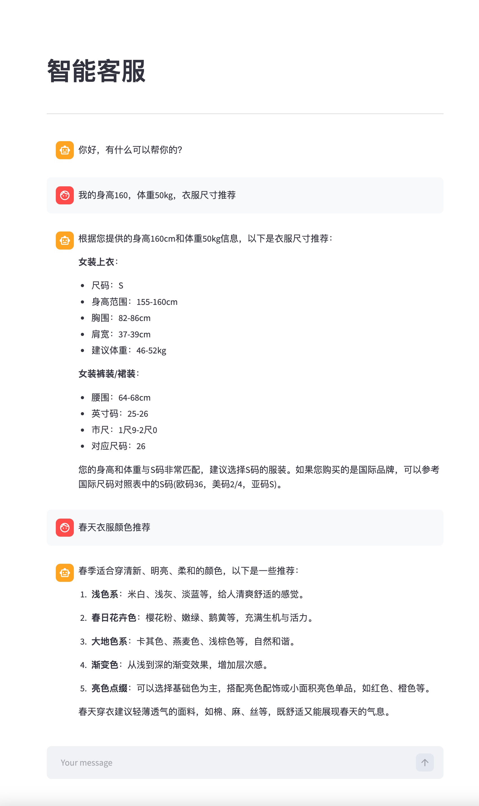

# 智能客服 RAG 系统

这是一个基于 `LangChain + Chroma + Streamlit + 智谱 AI` 的轻量级智能客服 RAG 项目。系统支持上传知识库文本、向量化存储、基于检索增强生成回答，并保留多轮对话历史，适合作为客服问答、产品知识助手、FAQ 机器人等场景的基础示例。

当前仓库内已经包含一份服装尺码知识样例数据：[data/衣服尺寸.txt](./data/衣服尺寸.txt)，可以直接用于演示“尺码推荐 / 穿搭问答”类问答流程。

## 效果图



## 功能特性

- 基于本地文本文件构建知识库，支持通过页面上传 `.txt` 文件
- 使用 `ZhipuAIEmbeddings` 将知识切片向量化并持久化到本地 `Chroma`
- 使用 `ChatZhipuAI` 结合检索结果生成答案
- 支持多轮对话历史注入，提高上下文连续性
- 支持流式输出回答
- 基于 MD5 对上传内容做去重，避免重复写入知识库

## 项目结构

```text
rag/
├── app_file_uploader.py   # Streamlit 知识库上传页面
├── app_qa.py              # Streamlit 智能客服问答页面
├── rag.py                 # RAG 主链路：检索、提示词、模型、历史消息
├── knowledge_base.py      # 知识入库、文本切分、Chroma 写入
├── vector_stores.py       # 向量检索器封装
├── file_history_store.py  # 对话历史文件存储
├── config_data.py         # 统一配置项
├── data/衣服尺寸.txt      # 示例知识库文本
├── char_history/          # 对话历史持久化目录
├── chroma_db/             # Chroma 持久化目录
├── md5.txt                # 已入库文本的 MD5 记录
└── main.py                # 当前未使用
```

## 工作流程

```text
上传知识文本
  -> 文本切分
  -> 向量化并写入 Chroma
  -> 用户提问
  -> 检索相关知识片段
  -> 拼接历史对话与提示词
  -> 智谱大模型生成答案
  -> Streamlit 流式展示结果
```

## 运行环境

- Python `3.11+`，当前开发环境为 `Python 3.11.2`
- macOS / Linux 均可，Windows 也可运行但命令请自行调整

## 安装依赖

项目中暂未提供 `requirements.txt`，可以先按下面方式安装运行所需依赖：

```bash
python3 -m venv .venv
source .venv/bin/activate
pip install --upgrade pip
pip install streamlit langchain-core langchain-chroma langchain-text-splitters langchain-zhipu chromadb
```

如果你准备把项目继续维护下去，建议后续补充一份 `requirements.txt` 或 `pyproject.toml`，便于部署和复现。

## 环境变量配置

在运行前需要配置智谱 AI 的 API Key。

当前项目已经统一使用 `ZHIPU_API_KEY`。

```bash
export ZHIPU_API_KEY="你的智谱 API Key"
```

如果你使用的是 `.env` 文件，也请确保其中包含这个变量。

## 核心配置

主要配置位于 [config_data.py](./config_data.py)：

- `collection_name`：Chroma collection 名称
- `persist_directory`：向量库持久化目录
- `chunk_size`：文本切片大小
- `chunk_overlap`：切片重叠长度
- `similarity_threshold`：检索返回的片段数量，实际作用等同于 `k`
- `embedding_model_name`：嵌入模型，当前为 `embedding-3`
- `chat_model_name`：对话模型，当前为 `glm-5.1`
- `session_config`：默认会话 ID

如果你想提升召回质量，通常优先调整 `chunk_size`、`chunk_overlap` 和检索数量。

## 启动方式

这个项目不是单入口应用，而是两个独立的 Streamlit 页面：

### 1. 启动知识库上传页面

```bash
streamlit run app_file_uploader.py --server.port 8501
```

打开页面后，可以上传 `.txt` 文件。首次体验时，建议直接上传仓库里的示例文件：

```text
data/衣服尺寸.txt
```

上传成功后，文本会被切分并写入本地向量库 `chroma_db/`。

### 2. 启动智能客服问答页面

```bash
streamlit run app_qa.py --server.port 8502
```

打开页面后即可直接提问，例如：

- `我身高 170cm，尺码推荐`
- `春天穿什么颜色的衣服`
- `女装裤装 27 码对应多少腰围`

## 使用说明

1. 先启动上传页面并导入知识库文本
2. 再启动问答页面进行提问
3. 模型会先检索本地知识片段，再结合历史消息生成回答
4. 多轮对话历史会写入 `char_history/user_123`

默认会话 ID 固定为 `user_123`，所以当前版本更适合单用户本地演示。如果需要支持多个用户，需要把 `session_id` 改为动态值。

## 数据持久化说明

- `chroma_db/`：保存向量库数据
- `md5.txt`：保存已经入库过的文本 MD5，用于去重
- `char_history/`：保存历史对话消息

删除这些目录或文件后，系统会失去对应的持久化数据。

## 代码说明

- [app_file_uploader.py](./app_file_uploader.py)：上传文件并调用 `KnowledgeBaseService.upload_by_str`
- [knowledge_base.py](./knowledge_base.py)：负责文本切片、写入 Chroma、MD5 去重
- [vector_stores.py](./vector_stores.py)：封装 Chroma 检索器
- [rag.py](./rag.py)：构建完整 RAG Chain，并接入历史消息
- [file_history_store.py](./file_history_store.py)：将聊天记录保存到本地文件
- [app_qa.py](./app_qa.py)：负责前端聊天交互和流式输出

## 已知注意事项

- 当前仅支持上传 `.txt` 文件，不支持 PDF、Word、Excel 等格式
- 当前默认会话 ID 写死为 `user_123`，多用户会共用同一份历史记录
- `main.py` 目前为空文件，不参与运行
- `similarity_threshold` 这个命名容易误导，它在当前代码里实际表示“返回前 `k` 条检索结果”

## 后续优化建议

- 增加 `requirements.txt` 或 `pyproject.toml`
- 支持更多文档格式，如 PDF、DOCX、Markdown
- 增加会话隔离和用户身份管理
- 支持知识库删除、重建、更新和管理页面
- 为检索结果增加来源引用展示
- 增加异常处理、日志和单元测试

## 演示场景

当前示例知识库适合以下问题类型：

- 服装尺码推荐
- 国际尺码对照
- 上衣、裤装、裙装测量说明
- 季节穿搭颜色建议

如果你要改造成其他行业客服，只需要替换知识库内容即可，例如商品参数、售后政策、业务 FAQ、内部操作手册等。
